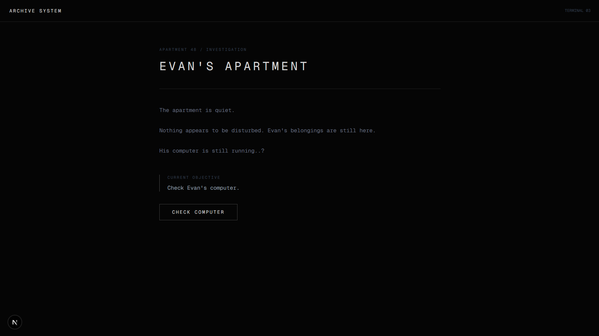
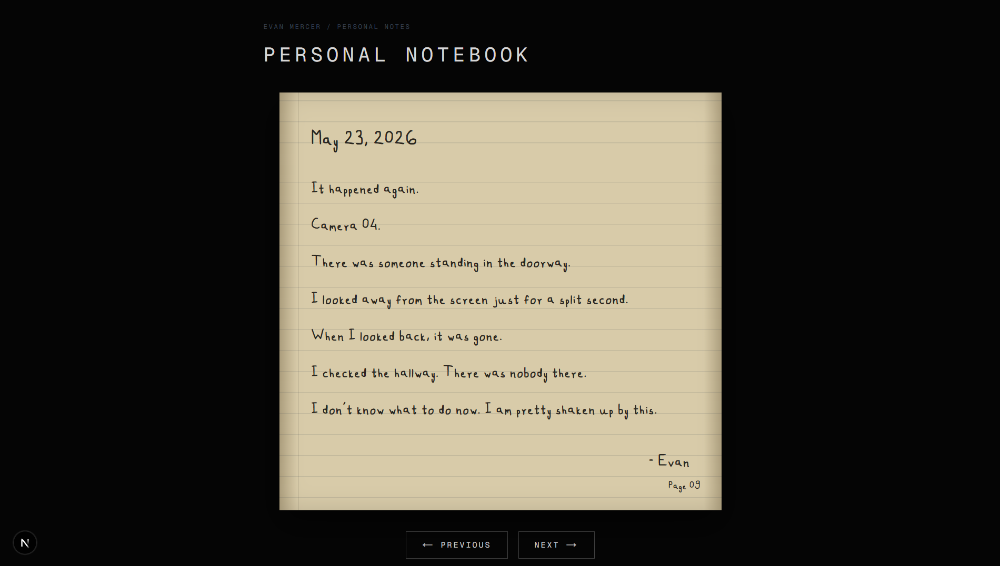
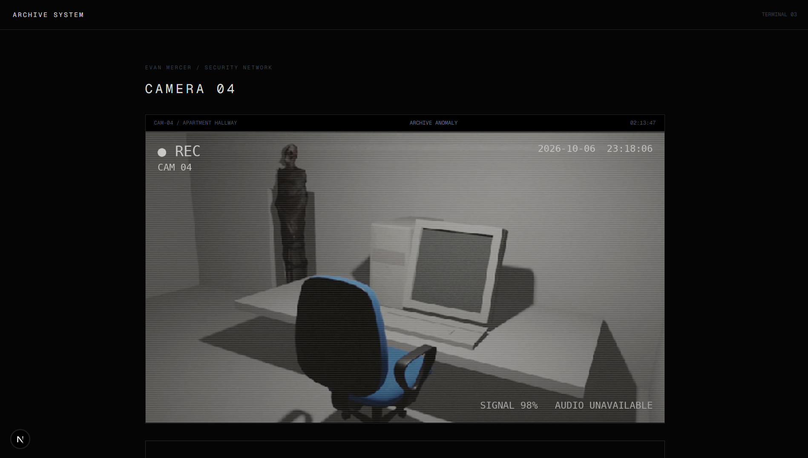
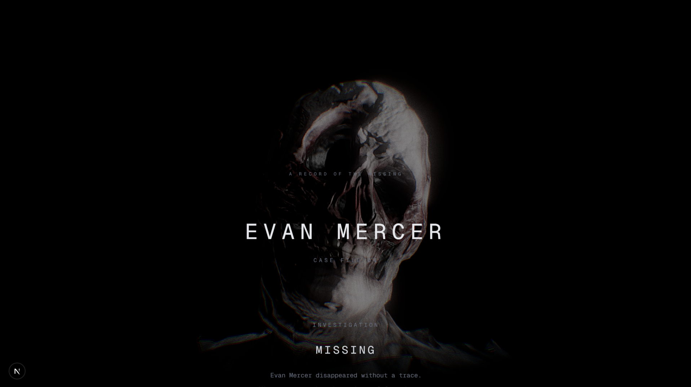

# Archive

> You were assigned to investigate a missing person. What you discover in his apartment was never meant to be found.

## Overview

I created and built this project as a psychological horror experience focused on investigation, surveillance, and the fear of being watched.

**Archive** is a browser based psychological horror game where you investigate the disappearance of Evan Mercer. What initially appears to be a straightforward missing person case slowly turns into something much more disturbing.

Evan's apartment, personal notes, browser history, research files, and security camera recordings reveal that he had been investigating a strange entity that can only be seen through recordings.

The more you investigate it, the more it appears.

And eventually, it notices you.

---

## Motivation

I've always been fascinated by psychological horror that doesn't rely entirely on constant jumpscares.

I wanted to create something where the player slowly realizes that the information they're uncovering is actually making the situation worse. The CCTV footage, notes, and research are all meant to build the story gradually before the final reveal.

The idea of an entity that cannot be seen directly, but can be observed through recordings, became the foundation of the entire game.

---

## Screenshots

<p align="center">
  
  <br>
  <em>Evan's apartment.</em>
</p>

<p align="center">
  
  <br>
  <em>Evan's personal notebook.</em>
</p>

<p align="center">
  
  <br>
  <em>Camera 04.</em>
</p>

<p align="center">
  
  <br>
  <em>The final record.</em>
</p>

---

## Tech Stack

| Category | Tech used |
|----------|-----------|
| Language | TypeScript |
| Framework | Next.js |
| Styling | Tailwind CSS |
| Graphics | Blender |
| 3D Assets | Blender / Sketchfab |
| Video | HTML5 Video |
| Audio | HTML5 Audio API |
| Version Control | Git + GitHub |
| Deployment | Vercel |

---

## Story

Evan Mercer has disappeared.

His apartment was found locked from the inside. His phone, wallet, and keys were still there.

While investigating the apartment, you discover Evan's personal notebook. His entries describe a figure appearing in his security camera recordings.

The figure isn't visible when Evan looks directly at the hallway.

It only appears in the recordings.

Evan eventually realizes something worse:

> The recordings aren't showing him something that happened.

> They're showing him something that knows he's watching.

His investigation eventually leads him to a terrifying conclusion — the entity becomes more present the more it is observed.

By the time you discover his final research, Evan is already gone.

And you've already been looking.

---

## How to Run?

### Prerequisites

- Node.js (v18 or later)
- npm

### Installation

Clone the repository:

```bash
git clone https://github.com/rawrrudy/archive.git
